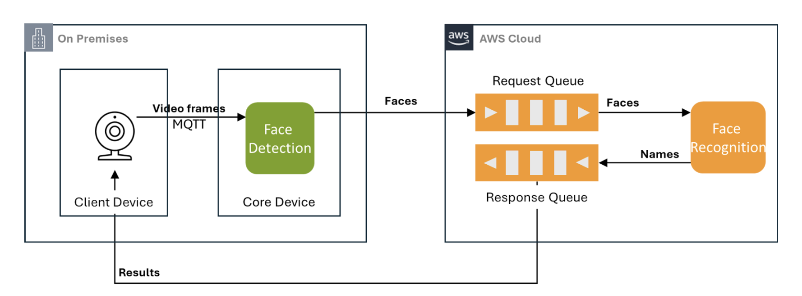

# Project 2: Edge-Based Face Recognition Pipeline

This repository implements a distributed face recognition pipeline using AWS IoT Greengrass, AWS Lambda, and supporting services (SQS, ECR). It extends the serverless solution from Part I by moving face detection to the edge (Greengrass Core) and keeping face recognition in the cloud.

## Architecture



1. **IoT Device (Emulated on EC2 Ubuntu)** publishes Base64‑encoded video frames to an MQTT topic (`clients/IoTThing`).
2. **Greengrass Core (EC2 Amazon Linux)** runs the Face Detection component:

   * Subscribes to the MQTT topic via the local Greengrass broker.
   * Decodes, runs MTCNN face detection, encodes detected face images as PNG Base64.
   * Sends detection results (`request_id`, `face`) to an SQS request queue.
3. **AWS Lambda** (face‑recognition) is triggered by SQS:

   * Loads `InceptionResnetV1` (FaceNet) model and `resnetV1_video_weights.pt`.
   * Computes face embeddings, compares against stored embeddings, and classifies.
   * Pushes classification results (`request_id`, `result`) to the SQS response queue.
4. **IoT Device** polls the response queue to fetch and handle recognition results.

## Components

* **Face Detection (Greengrass)**

  * `fd_component.py`: subscribes to MQTT, runs MTCNN, pushes to SQS.
  * Bundled with `facenet_pytorch` code and dependencies.

* **Face Recognition (Lambda)**

  * `fr_lambda.py`: consumes SQS messages, loads FaceNet model, performs classification.
  * Uses `resnetV1_video_weights.pt` for pretrained embeddings.

* **Container & Dependencies**

  * `Dockerfile`: builds a Python (Debian slim) image with required packages and models.
  * `requirements.txt`: lists Python dependencies for local development and Lambda deployment.

## Getting Started

1. **Build & Push ECR Image**

   ```bash
   # build
   docker build -t face-pipeline:latest .
   # tag & push to ECR
   aws ecr create-repository --repository-name face-pipeline
   docker tag face-pipeline:latest <aws_account>.dkr.ecr.us-east-1.amazonaws.com/face-pipeline:latest
   aws ecr get-login-password | docker login --username AWS --password-stdin <aws_account>.dkr.ecr.us-east-1.amazonaws.com
   docker push <...>/face-pipeline:latest
   ```

2. **Deploy Greengrass Component**

   ```bash
   mkdir -p ~/greengrassv2/{recipes,artifacts}
   cp recipes/com.clientdevices.FaceDetection-1.0.0.json ~/greengrassv2/recipes/
   cp -r artifacts/com.clientdevices.FaceDetection/ ~/greengrassv2/artifacts/
   sudo /greengrass/v2/bin/greengrass-cli deployment create \
     --recipeDir ~/greengrassv2/recipes \
     --artifactDir ~/greengrassv2/artifacts \
     --merge "com.clientdevices.FaceDetection=1.0.0"
   ```

3. **Configure MQTT Topic Mapping**
   Update the Greengrass MQTT bridge component to map `LocalMqtt` ↔ `IotCore` on `clients/IoTThing`.

4. **Deploy Lambda Function**

   * Zip `fr_lambda.py`, `resnetV1_video_weights.pt`, and dependencies.
   * Create Lambda on AWS console, attach SQS trigger to `req-queue`.

5. **Testing**

   * Publish sample frames via AWS IoT MQTT test client.
   * Monitor `/greengrass/v2/logs/com.clientdevices.FaceDetection.log` on core.
   * Verify messages in SQS response and output on device.

## Notes

* Models and weights are loaded lazily (cold start) then cached in Lambda/ECR container.
* Face detection uses CoW snapshots for rapid Greengrass component updates.
* Ensure all AWS resources (Core, Client, SQS queues, Lambda) are in `us-east-1`.
